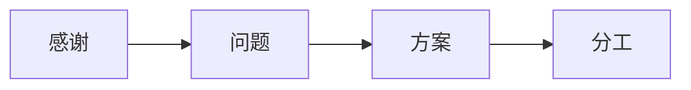

# 家庭和谐育儿解决方案

## 三步化解矛盾，全家轻松执行

---

### 一、常见矛盾根源

**三种核心冲突类型**
1. **管教标准不同**
    - 孩子哭闹时，大人处理方法不一致
    - 规则有时执行有时不执行
2. **责任分配不清**
    - 谁该管孩子吃饭/睡觉/玩耍不明确
    - 老人和父母分工模糊
3. **情绪处理不当**
    - 孩子闹脾气时大人跟着生气
    - 大人之间意见不合就争吵

---

### 二、每月家庭圆桌会议（30分钟）

**四步简单流程**

**具体步骤：**
1. **互相感谢**
    - 每人说1件感谢其他家庭成员的事
    - 例：“谢谢奶奶每天做营养早餐”
2. **提出问题**
    - 共同选出1个最需要解决的育儿问题
    - 例：“早上起床太拖拉”
3. **定解决方案**
    - 全家同意1个简单办法
    - 例：“用闹钟提醒，8点前起床有贴纸”
4. **明确分工**
    - 写下谁负责什么（参考分工表）

 **_📌注意：每月只解决1个重点问题_**

---

### 三、关键执行工具

**工具1：情绪暂停角**

* 三步使用法
1. 谁用：任何感到生气的家庭成员
2. 怎么做：说“我需要暂停”，去指定位置（如书房），安静待5-10分钟
3. 回来：情绪平稳后再说话
* _✅ 优点：避免争吵升级_

**工具2：可视化分工表(一周分工)**

| 时间段      | 主要责任人 | 辅助人 | 具体任务     |
|----------|-------|-----|----------|
| 早7-8点半   | 爸爸    | 妈妈  | 起床、早饭、上学 |
| 晚上7半-9点  | 妈妈    | 爸爸  | 陪玩、洗澡、睡觉 |
| 早7、下午3点半 | 奶奶    |     | 早饭、接娃、早教 |
| 10点、16点  | 爷爷    |     | 中饭、晚饭    |
| 8点、19点   | 爷爷    |     | 遛狗       |
| 周末       | 爸爸    |  妈妈  | 户外、早教    |

工具3：家庭规则提示板

**三要素制作指南**
1. **内容**（3条核心规则）：
    - 贴图+文字（例：🕖7点起床 + 文字）
    - 饭前洗手
    - 9点睡觉

2. **位置**：  
   孩子能看到的地方（客厅墙）

3. **使用**：  
   孩子不听话时指提示板，不用说话

---

### 四、全家行动承诺
我们承诺：
1. [ ] 每月开家庭会议  
2. [ ] 生气时用暂停角  
3. [ ] 按分工表执行  
4. [ ] 遵守规则提示板

签名区：
爸爸：_______ 妈妈：_______ 爷爷：_______ 奶奶：_______ 宝宝：_______

🌟 执行秘诀：每次做到后互相点赞鼓励
